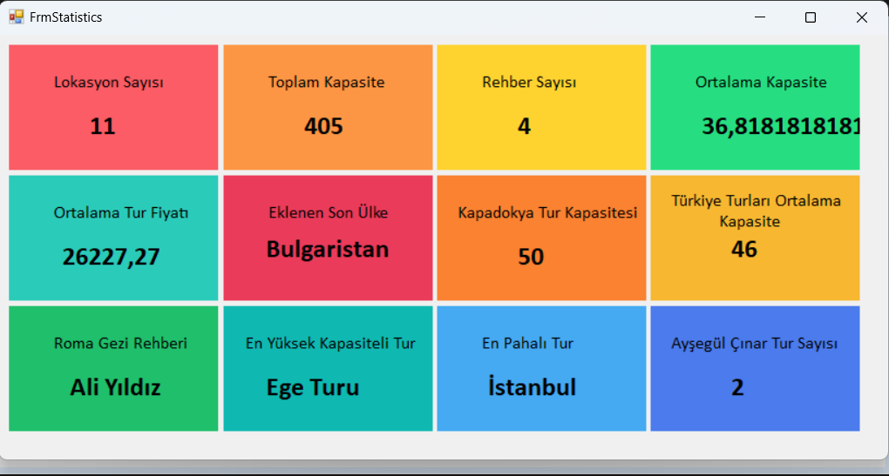

# C# Eðitim Kampý Projesi

Bu projede, Entity Framework kullanarak veritabaný ile etkileþimde bulundum ve LINQ ifadeleri ile çeþitli istatistiksel veriler topladým. Aþaðýda öðrendiðim bazý anahtar konular bulunmaktadýr:

## Öðrenilen Konular

- **LINQ Kullanýmý**: Veritabanýndaki lokasyonlarýn sayýsýný, kapasite toplamýný, fiyat ortalamasýný gibi hesaplamalar yaptým.
- **Filtreleme ve Sorgulama**: Belirli þehirlerdeki lokasyonlar ve rehberler hakkýnda detaylý bilgi almak için LINQ ile filtreleme iþlemleri gerçekleþtirdim.
- **Veri Baðlama**: Kullanýcý arayüzüne dinamik olarak veri baðlama konusunu deneyimledim.
- **Veritabaný Ýliþkileri**: En büyük kapasiteye sahip lokasyonu veya en yüksek fiyatlý lokasyonu sorgulama gibi iþlemleri gerçekleþtirdim.

Bu süreç, veritabaný sorgularý ve kullanýcý arayüzü entegrasyonu konularýnda önemli bilgiler edinmeme yardýmcý oldu.

